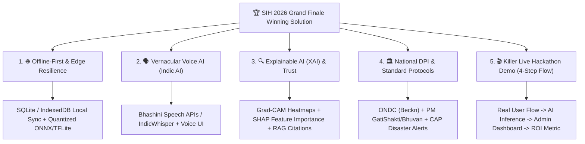

# 🎯 SIH 2026 — Focused High-Impact Software Problem Statements (Comprehensive Hinglish Guide)

> **Smart India Hackathon (SIH 2026) | Curated Focus Playbook**  
> **Selected Focus Track:** 14 High-Impact Software Problem Statements  
> **Selection Criteria:** Maximum Scope for Technical Innovation (AI/ML, GenAI, CV, GNNs, Edge AI) + Massive Social Impact in Society

---

## 📌 Table of Contents
1. [Curated Problem Statements Overview Table](#-curated-problem-statements-overview-table)
2. [Detailed Problem Statement Breakdowns](#-detailed-problem-statement-breakdowns)
   - [1. `[SIH26003]` AI-Based Cognitive Gaming and Memory Assistance Platform for Elderly Dementia Patients in North Eastern Region (NER)](#1-sih26003-ai-based-cognitive-gaming-and-memory-assistance-platform-for-elderly-dementia-patients-in-north-eastern-region-ner)
   - [2. `[SIH26001]` AI-Based early warning and landslide Risk Monitoring System in NER](#2-sih26001-ai-based-early-warning-and-landslide-risk-monitoring-system-in-ner)
   - [3. `[SIH26072]` AIML based Nowcasting of thunderstorm and lightning using atmospheric observation including multiple radars, satellite, lightning and model data](#3-sih26072-aiml-based-nowcasting-of-thunderstorm-and-lightning-using-atmospheric-observation-including-multiple-radars-satellite-lightning-and-model-data)
   - [4. `[SIH26085]` Urban Flood Nowcasting System (Drainage and Rainfall Coupling)](#4-sih26085-urban-flood-nowcasting-system-drainage-and-rainfall-coupling)
   - [5. `[SIH26068]` WeatherGPT: Conversational AI for Weather Forecasting, Alerts, and Climate Information](#5-sih26068-weathergpt-conversational-ai-for-weather-forecasting-alerts-and-climate-information)
   - [6. `[SIH26031]` Quality assessment and grading of onions are often subjective and vary across procurement centers, resulting in disputes and inconsistencies](#6-sih26031-quality-assessment-and-grading-of-onions-are-often-subjective-and-vary-across-procurement-centers-resulting-in-disputes-and-inconsistencies)
   - [7. `[SIH26014]` An lntegrated GIS-based Digital Public lnfrastructure for Land Governance](#7-sih26014-an-lntegrated-gis-based-digital-public-lnfrastructure-for-land-governance)
   - [8. `[SIH26090]` AI-Driven Market Linkage and Smart Cataloging Mobile Application for Marginalized Artisans](#8-sih26090-ai-driven-market-linkage-and-smart-cataloging-mobile-application-for-marginalized-artisans)
   - [9. `[SIH26091]` AI-Driven Hyper-Local Business Advisory and Financial Structuring Assistant for Rural Micro-Entrepreneurs](#9-sih26091-ai-driven-hyper-local-business-advisory-and-financial-structuring-assistant-for-rural-micro-entrepreneurs)
   - [10. `[SIH26184]` Development of a Predictive Analytics Framework for Cybercrime Complaints to Forecast Likely Cash Withdrawal Locations in Advance, Enabling Generation of Actionable Intelligence for Timely and Proactive Cybercrime Intervention](#10-sih26184-development-of-a-predictive-analytics-framework-for-cybercrime-complaints-to-forecast-likely-cash-withdrawal-locations-in-advance-enabling-generation-of-actionable-intelligence-for-timely-and-proactive-cybercrime-intervention)
   - [11. `[SIH26093]` AI-Based Real-Time Stress and Trauma Assessment Module for Victims/Complainants Accessing NHAA (14566) and Integrated Portal](#11-sih26093-ai-based-real-time-stress-and-trauma-assessment-module-for-victimscomplainants-accessing-nhaa-14566-and-integrated-portal)
   - [12. `[SIH26094]` AI-Powered Dynamic Mental Health Monitoring and Distress Prediction System for Victims of Atrocities](#12-sih26094-ai-powered-dynamic-mental-health-monitoring-and-distress-prediction-system-for-victims-of-atrocities)
   - [13. `[SIH26042]` Al-Powered Vernacular Pedagogy and Real-Time Translation Tool for Mother Tongue-Based Primary Education](#13-sih26042-al-powered-vernacular-pedagogy-and-real-time-translation-tool-for-mother-tongue-based-primary-education)
   - [14. `[SIH26167]` SatQuery AI - An Interactive Vision-Language Assistant for Multimodal Remote Sensing Image Analysis through Text Queries](#14-sih26167-satquery-ai---an-interactive-vision-language-assistant-for-multimodal-remote-sensing-image-analysis-through-text-queries)
3. [SIH 2026 Grand Finale Winning Blueprint (Jeetne Ka Master Plan)](#-sih-2026-grand-finale-winning-blueprint)

---

## 📊 Curated Problem Statements Overview Table

| Domain / Category | PS Code | Problem Statement Title | Organization / Ministry | Core Innovation Vector (Hinglish) |
| :--- | :--- | :--- | :--- | :--- |
| **Healthcare & Mental Health** | **`SIH26003`** | AI-Based Cognitive Gaming and Memory Assistance Platform for Elderly Dementia Patients in North Eastern Region (NER) | Ministry of Development of North Eastern Region (MDoNER) | AI Cognitive Games, Voice Biomarkers aur Dementia Memory Copilot |
| **Disaster & Climate Resilience** | **`SIH26001`** | AI-Based early warning and landslide Risk Monitoring System in NER | Ministry of Development of North Eastern Region (MDoNER) | Multi-Source Satellite aur IoT Sensors se Landslide Early Warning |
| **Disaster & Climate Resilience** | **`SIH26072`** | AIML based Nowcasting of thunderstorm and lightning using atmospheric observation including multiple radars, satellite, lightning and model data. | Ministry of Earth Sciences (MoES) | Radar, Satellite aur Lightning Data par Deep Learning Nowcasting (0-3 hrs) |
| **Disaster & Climate Resilience** | **`SIH26085`** | Urban Flood Nowcasting System (Drainage and Rainfall Coupling) | Ministry of Earth Sciences (MoES) | 1D-2D Hydrodynamic & Rainfall Coupled Urban Inundation Modeling |
| **Disaster & Climate Resilience** | **`SIH26068`** | WeatherGPT: Conversational AI for Weather Forecasting, Alerts, and Climate Information | Ministry of Earth Sciences (MoES) | Multilingual Climate RAG aur Farmers ke liye Voice-LLM Agent |
| **Agriculture & Farmer Welfare** | **`SIH26031`** | Quality assessment and grading of onions are often subjective and vary across procurement centers, resulting in disputes and inconsistencies. | Ministry of Consumer Affairs, Food & Public Distribution | Fair Produce Grading ke liye Computer Vision Instance Segmentation |
| **Agriculture & Land Rights** | **`SIH26014`** | An lntegrated GIS-based Digital Public lnfrastructure for Land Governance | Ministry of Rural Development | Land Governance ke liye Integrated GIS-based Digital Public Infrastructure |
| **Social Justice & Micro-Economy** | **`SIH26090`** | AI-Driven Market Linkage and Smart Cataloging Mobile Application for Marginalized Artisans | Ministry of Social Justice and Empowerment (MoSJE) | Generative AI Photography, Vernacular Copywriting aur ONDC Integration |
| **Social Justice & Micro-Economy** | **`SIH26091`** | AI-Driven Hyper-Local Business Advisory and Financial Structuring Assistant for Rural Micro-Entrepreneurs | Ministry of Social Justice and Empowerment (MoSJE) | Rural Entrepreneurs ke liye Hyper-Local Vernacular AI Financial Copilot |
| **Citizen Safety & Anti-Fraud** | **`SIH26184`** | Development of a Predictive Analytics Framework for Cybercrime Complaints to Forecast Likely Cash Withdrawal Locations in Advance, Enabling Generation of Actionable Intelligence for Timely and Proactive Cybercrime Intervention. | Ministry of Home Affairs | Cybercrime ATM Cashout Location Predict karne ke liye Graph Neural Networks |
| **Citizen Safety & Justice** | **`SIH26093`** | AI-Based Real-Time Stress and Trauma Assessment Module for Victims/Complainants Accessing NHAA (14566) and Integrated Portal | Ministry of Social Justice and Empowerment (MoSJE) | National Helpline (14566) ke liye Real-Time Acoustic Voice Stress Analysis |
| **Citizen Safety & Justice** | **`SIH26094`** | AI-Powered Dynamic Mental Health Monitoring and Distress Prediction System for Victims of Atrocities | Ministry of Social Justice and Empowerment (MoSJE) | Atrocity Victims ke liye Dynamic Longitudinal Mental Health Monitoring |
| **Inclusive Education** | **`SIH26042`** | Al-Powered Vernacular Pedagogy and Real-Time Translation Tool for Mother Tongue-Based Primary Education | Governmcnt of Jharkhand | Mother-Tongue Education ke liye AI Vernacular Pedagogy aur Voice Translation |
| **Space & Environmental Tech** | **`SIH26167`** | SatQuery AI - An Interactive Vision-Language Assistant for Multimodal Remote Sensing Image Analysis through Text Queries | Indian Space Research Organisation (ISRO) | Multimodal Remote Sensing ke liye SatQuery AI: Vision-Language Assistant (ISRO) |

---

## 📌 Detailed Problem Statement Breakdowns

---

### 1. `[SIH26003]` AI-Based Cognitive Gaming and Memory Assistance Platform for Elderly Dementia Patients in North Eastern Region (NER)

- **Official Organization:** Ministry of Development of North Eastern Region (MDoNER)
- **Department:** Ministry of Development of North Eastern Region (MDoNER)
- **Theme:** Space Technology / Healthcare
- **Category:** Software

> **🌍 Social Impact & Societal Relevance (Samajik Mahatva):**  
> North East ke door-daraaz aur pahadi ilaqon mein specialized neurological clinics aur dementia care facilities ki bohot kami hai. Yeh platform buzurg dementia aur Alzheimer's ke mareezon ko bina dawa ke cognitive stimulation (mansik kasrat) aur unke rog ke badhne ko lagatar track karne ki suvidha deta hai.

> **💡 Scope for Technological Innovation (Technical Innovation):**  
> Adaptive Reinforcement Learning jo patient ki performance ke hisab se games ki difficulty ko dynamically adjust kare; multimodal acoustic voice biomarker extraction (speech pauses, jitter, shimmer, lexical density) taaki bolne ke tarike se hi mansik kamzori track ho sake; regional languages me family memory copilot with facial recognition.

> **🛠️ Recommended Tech Stack:**  
> `Unity / React Native (Gamified Frontend), WebRTC / Librosa (Audio Biomarker Pipeline), PyTorch / HuggingFace (NLP & Sequence Analysis), FastAPI, SQLite (Offline Mode), Firebase Cloud Sync.`

> **🏆 Winning Hackathon Demo Pitch (Demo Strategy):**  
> Ek working mobile app dikhao jisme buzurg memory game khelte hain, AI unki aawaz ko real-time analyze karke "Cognitive Vitality Score" generate karta hai, aur agar memory me achanak girawat aaye toh family members ko turant alert bhejta hai.

#### 📋 Official Problem Description & Scope (Pura Vivaran):
> **Background (Pithbhoomi):**  
> North Eastern Region (NER) mein buzurg aabadi ke andar age-related cognitive disorders jaise dementia aur memory loss ke mamle lagatar badh rahe hain. Rural aur hilly areas ke parivaaron ko specialized neurological care, cognitive therapy aur long-term support services milne me badi rukawate aati hain kyunki wahan healthcare infrastructure limited hai aur geographical barriers hain. Dementia se graseet buzurg memory loss, confusion, anxiety aur akelepan ka samna karte hain, jabki caregivers ke paas unhe lagatar engage aur monitor karne ke aasan tools nahi hain. NER ke buzurgon ke liye affordable aur culturally inclusive digital solutions ki bohot kami hai. Isiliye ek accessible, engaging aur AI-enabled cognitive gaming platform ki sakht zaroorat hai.

> **Description & Functional Requirements:**  
> Is problem statement ka maksad NER ke dementia patients ke liye AI-powered cognitive gaming aur memory assistance platform tayyar karna hai. Solution me ye sab shamil hona chahiye:
> 
> **a. Interactive Cognitive Games aur Activities jo in par focus karein:**
> - Memory improvement (yaaddasht sudharna)
> - Attention aur concentration (dhyan kendrit karna)
> - Daily routine recall (rozmarra ke kaamon ko yaad rakhna)
> - Pattern aur object recognition
> - Emotional aur mental engagement
> 
> **b. Adaptive AI/ML Algorithms:** Patient ki performance aur cognitive condition ke hisab se game ke difficulty levels ko dynamically change karna.  
> **c. Multilingual & Voice-Assisted Interaction:** NER ke buzurg users ke liye aasan voice interaction aur regional languages ka support.  
> **d. Cultural Familiarity:** Local aur culturally familiar themes, visuals, sounds aur regional bhashayein taaki buzurg easily relate kar sakein.  
> **e. Smart Daily Reminders:**
> - Medicines (Dawaaiyan)
> - Hydration (Paani peena)
> - Daily activities (Roz ke kaam)
> - Medical appointments (Doctor ki visit)
> 
> **f. Caregiver & Health Worker Dashboard:** Patient ki progress, activity levels aur decline trends ko monitor karne ke liye web/mobile dashboard.  
> **g. Low-Connectivity & Offline Support:** Door-daraaz ke ilaqon me jahan internet kam ya band ho, wahan offline chalna aur internet aane par sync hona.  
> **h. Simple & Elderly-Friendly UI/UX:** Tablet aur mobile ke liye bade buttons, saaf font aur zero-confusion interface.

> **Expected Solution (Apekshit Hal):**  
> Ek user-friendly AI cognitive assistance platform jisme adaptive gaming, voice-enabled multilingual interface, performance tracking analytics, caregiver alert system, offline sync aur secure patient data management ho.

---

### 2. `[SIH26001]` AI-Based early warning and landslide Risk Monitoring System in NER

- **Official Organization:** Ministry of Development of North Eastern Region (MDoNER)
- **Department:** Ministry of Development of North Eastern Region (MDoNER)
- **Theme:** Disaster Management
- **Category:** Software

> **🌍 Social Impact & Societal Relevance (Samajik Mahatva):**  
> North East aur Himalayan ilaqon ko bhishan landslides, flash floods aur sadak bandi se bachana. Hadsa hone se 24 se 48 ghante pehle automated predictive alerts dekar district disaster teams aur aam janta ki jaan-maal ki raksha karna.

> **💡 Scope for Technological Innovation (Technical Innovation):**  
> Multi-source sensor fusion: InSAR satellite se zameen ka khisakna (slope displacement), IoT soil moisture sensors, aur IMD rainfall intensity models ko Spatio-Temporal Graph Neural Networks (GNNs) se fuse karna; offline mesh synchronization aur automated SMS/CAP early warning dispatch.

> **🛠️ Recommended Tech Stack:**  
> `Google Earth Engine API, PyTorch (Temporal Spatial Graph Neural Networks), PostGIS / GeoServer, FastAPI, Flutter / React PWA with SQLite offline sync.`

> **🏆 Winning Hackathon Demo Pitch (Demo Strategy):**  
> Ek district ka 3D GIS terrain heatmap dikhao jisme bhaari baarish simulate karne par real-time risk level badhe, band sadkon ka alternative route plan ho, aur gaon ke pradhan aur citizens ke mock phones par automated SMS alerts trigger ho jayein.

#### 📋 Official Problem Description & Scope (Pura Vivaran):
> **Background (Pithbhoomi):**  
> North Eastern Region (NER) me bhaari baarish, kamzor pahadi banawat aur unplanned hill cutting ki wajah se aksar landslides, achanak baadh (flash floods), aur road blockages aate rehte hain. Isse emergency services ruk jati hain aur pahadi gaon dino tak baki duniya se kat jaate hain. Filhal monitoring reactive hai (hadsa hone ke baad manual report hoti hai). Real-time prediction aur early warning system ki kami hai. Climate vulnerability badhne ke chalte AI-enabled real-time monitoring system ki sakht zaroorat hai.

> **Description & Functional Requirements:**  
> NER ke landslide prone areas ko real-time track aur predict karne ke liye ek AI platform develop karna hai. Solution me ye sab hona chahiye:
> 
> **a. Data Collection aur Analysis:**
> - Rainfall patterns (Baarish ka anuman aur live data)
> - Soil moisture sensors (Mitti me nami ke IoT sensors)
> - Satellite imagery (InSAR / optical slope movement)
> - Terrain/slope data (Digital Elevation Models - DEM)
> - Historical landslide records (Purane hadson ka data)
> 
> **b. AI/ML Prediction Models:** High-risk zones identify karna aur landslide hone se pehle event ko predict karna.  
> **c. Real-Time Alerts:** District administration, disaster management authorities aur local gaon ke logon ko instant alerts bhejna.  
> **d. GIS Mapping:** Vulnerable sadkon, gaon aur infrastructure ka visual map dikhana.  
> **e. Field Reporting Feature:** Citizens aur field staff ke liye geo-tagged photo/video upload karne ka feature (dararen, zameen khisakna, ya rasta band hona).  
> **f. Comprehensive Dashboards:**
> - Risk severity levels (Khatre ka level)
> - Road connectivity status (Raste khule hain ya band)
> - Weather-linked risk forecasts (Mausam ke hisab se khatre ka anuman)
> - Emergency response prioritization (Kahan pehle madad bheji jaye)
> - Multilingual notifications aur offline functionality support.

> **Expected Solution (Apekshit Hal):**  
> Ek scalable AI software platform jisme real-time GIS dashboard, predictive analytics engine, field reporting mobile app, IMD weather APIs aur satellite feeds ka integration, automated SMS/app early warnings, aur offline sync architecture shamil ho.

---

### 3. `[SIH26072]` AIML based Nowcasting of thunderstorm and lightning using atmospheric observation including multiple radars, satellite, lightning and model data.

- **Official Organization:** Ministry of Earth Sciences (MoES)
- **Department:** India Meteorological Department (IMD)
- **Theme:** Disaster Management
- **Category:** Software

> **🌍 Social Impact & Societal Relevance (Samajik Mahatva):**  
> Bharat me har saal bijli girne (lightning strikes) aur toofan se hazaron kisan aur khule aasmaan ke neeche kaam karne wale mazdoor jaan gawa dete hain. Gaon/block level par 0-3 ghante ka accurate early warning milne se hazaron zindagiyan bachayi ja sakti hain.

> **💡 Scope for Technological Innovation (Technical Innovation):**  
> Spatio-temporal deep learning (ConvLSTM, PredRNN, Earthformer) jo INSAT-3D/3DR satellite imagery, Doppler Weather Radar (DWR) reflectivity, ground lightning detector networks aur NWP models ko sub-kilometer resolution par merge kare; Common Alerting Protocol (CAP) se direct automated broadcast.

> **🛠️ Recommended Tech Stack:**  
> `PyTorch Geometric / PyTorch Temporal, Xarray, Cartopy, Rasterio, Celery / Redis queue (Instant push notifications via SMS / WhatsApp / Webhook), Leaflet / Mapbox Frontend.`

> **🏆 Winning Hackathon Demo Pitch (Demo Strategy):**  
> Real-time radar animation chalao jisme AI aane wale 90 minutes me cloud-to-ground lightning strike kahan hogi uske exact probability contours draw kare aur high-risk area ke mock users ko instant priority alert bhej de.

#### 📋 Official Problem Description & Scope (Pura Vivaran):
> **Description:**  
> Multiple atmospheric observations (Doppler Weather Radars, Satellite feeds, Lightning detection sensor networks, aur NWP atmospheric model data) ka use karke AI/ML based Nowcasting system tayyar karna jo aane wale 0 se 3 ghanton me thunderstorm aur lightning ki accurate location, intensity aur timing predict kar sake.

---

### 4. `[SIH26085]` Urban Flood Nowcasting System (Drainage and Rainfall Coupling)

- **Official Organization:** Ministry of Earth Sciences (MoES)
- **Department:** National Centre for Medium Range Weather Forecasting (NCMRWF)
- **Theme:** Disaster Management
- **Category:** Software

> **🌍 Social Impact & Societal Relevance (Samajik Mahatva):**  
> Mumbai, Delhi, Bengaluru aur Chennai jaise shehron me har saal aane wali baadh, traffic jaam aur arbon ke nuksan ko rokna. Sadak-level par real-time paani bharne ki prediction dekar nagar nigam aur aam logon ko pehle se saavdhan karna.

> **💡 Scope for Technological Innovation (Technical Innovation):**  
> Coupled Physics-Informed Neural Networks (PINN) jo 1D underground stormwater drainage hydraulics (SWMM) aur 2D overland surface water flow ko IoT drain sensors ke sath couple kare; emergency gaadiyon ke liye dynamic flood-safe routing engine.

> **🛠️ Recommended Tech Stack:**  
> `Python, EPA-SWMM engine / PySWMM, GeoPandas, Mapbox GL / Cesium 3D, FastAPI, Leaflet dynamic flood depth overlay.`

> **🏆 Winning Hackathon Demo Pitch (Demo Strategy):**  
> Ek metro catchment area ka 3D Digital Twin dikhao jisme cloudburst simulate karne par har gali aur chowk me kitne centimeter paani bharega wo dikhe, aur ambulance ke liye automatically sukha aur surakshit rasta route ho jaye.

#### 📋 Official Problem Description & Scope (Pura Vivaran):
> **Background (Pithbhoomi):**  
> Indian metros me urban flooding ek varshik sankat ban chuki hai. Traditional Numerical Weather Prediction (NWP) models sirf ye batate hain ki kitni baarish hogi, lekin ye nahi batate ki kaunsi sadak ya gali doobegi. Urban flooding micro-topography, concrete surfaces aur underground drainage network ki capacity par depend karti hai. Shehari prashasan ke paas real-time street-level prediction tools nahi hain, jisse traffic gridlock aur jan-maal ki hani hoti hai.

> **Challenge & Detailed Scope:**  
> Ek high-resolution real-time Urban Flood Nowcasting System (0-3 hour lead time) design karna jo street-level inundation (paani bharna) pehle hi predict kare.
> 
> - **Coupled Framework:** Sirf weather model ke bajaye radar rainfall nowcasts ko high-resolution Digital Elevation Models (DEM) aur shehar ke underground drainage network (directed graph model: manholes as nodes, pipes as edges) ke sath couple karna.
> - **Hydraulic Overcapacity Calculation:** Calculate karna ki kahan drainage pipes full ho chuki hain aur kahan se backflow hokar sadak par paani aayega.
> - **Dynamic GIS Dashboard:** Web-based GIS dashboard jo har sadak par aane wale 0-3 ghante me paani ki gehrai (cm me) visually dikhaye.
> - **Navigation Map API:** Navigation maps ke sath integrate hokar emergency services aur aam public ko flood-safe alternate routes batane wala API interface.

---

### 5. `[SIH26068]` WeatherGPT: Conversational AI for Weather Forecasting, Alerts, and Climate Information

- **Official Organization:** Ministry of Earth Sciences (MoES)
- **Department:** India Meteorological Department (IMD)
- **Theme:** Disaster Management
- **Category:** Software

> **🌍 Social Impact & Societal Relevance (Samajik Mahatva):**  
> Complex scientific mausam bulletins aur aam kisan/nagrik ke beech ki doori ko mitana. Kisan apni bhasha me bolkar kheti, fasal suraksha aur aane wale mausam ki zaroori salah asani se le sakein.

> **💡 Scope for Technological Innovation (Technical Innovation):**  
> Real-time IMD observational datasets par trained RAG-powered climate LLM; multiple Indian dialects me voice-to-voice query answering; personalized agricultural crop-weather advisory engine.

> **🛠️ Recommended Tech Stack:**  
> `LangChain / LlamaIndex, Bhashini Speech APIs (ASR/TTS), FastAPI, ChromaDB / Pinecone, React PWA / WhatsApp Bot Interface.`

> **🏆 Winning Hackathon Demo Pitch (Demo Strategy):**  
> Ek live WhatsApp ya Voice Bot demo dikhao jahan kisan local dialect me bolta hai: *"Kya kal fasal par keetnashak spray karna theek rahega?"*, aur AI real-time rain probability aur hawa ki speed check karke saaf audio aur text me reference ke sath jawab deta hai.

#### 📋 Official Problem Description & Scope (Pura Vivaran):
> **Background (Pithbhoomi):**  
> Mausam ki jankari kayi alag-alag portals, bulletins aur satellites me bikhri hoti hai. Aam logon, researchers aur disaster managers ke liye quickly actionable insights lena mushkil hota hai. Ek aisi intelligent conversational platform ki zaroorat hai jo natural language me real-time weather information, alerts aur decision support de sake.

> **Objective:** 'WeatherGPT' naam ka AI-powered chatbot platform banana jo meteorological datasets, forecast models aur disaster warning systems ko integrate karke conversational interface ke zariye accurate aur multilingual jankari de.

> **Key Features (Mukhya Suvidhayein):**  
> 1. Real-time weather information retrieval.  
> 2. Weather forecast ke liye natural language querying.  
> 3. Numerical weather prediction (NWP) models (GFS/WRF) ke sath integration.  
> 4. Extreme weather alerts aur early warnings ka dissemination.  
> 5. Location-based forecasting aur farming advisory generation.  
> 6. Major Indian languages ke liye multilingual support.  
> 7. Climate trend aur historical weather analysis.  
> 8. Voice-enabled interaction taaki gaon ke log bol kar use kar sakein.

> **Suggested Tech Stack & Architecture:**  
> Python / FastAPI / Node.js, MQTT / WIS2.0 / WebSocket, LLMs (Gemini, Llama, OpenAI), GIS tools & weather APIs, PostgreSQL / MongoDB, Docker / Kubernetes.

> **Expected Outcomes & Use Cases:**  
> Tez jankari ka prasar, kheti ke liye crop advisories, aviation briefing, flood/cyclone warning dissemination, smart city weather monitoring, aur researchers ke liye climate analytics.

> **Evaluation Parameters (Judging Criteria):**  
> Accuracy aur relevance, Response latency (kitni jaldi jawab deta hai), Multilingual capability, UI/UX aur accessibility, Scalability, aur real-time systems ke sath live integration.

---

### 6. `[SIH26031]` Quality assessment and grading of onions are often subjective and vary across procurement centers, resulting in disputes and inconsistencies.

- **Official Organization:** Ministry of Consumer Affairs, Food & Public Distribution
- **Department:** Department of Consumer Affairs (DoCA)
- **Theme:** Fitness & Sports / Agriculture & Farmer Welfare
- **Category:** Software

> **🌍 Social Impact & Societal Relevance (Samajik Mahatva):**  
> Mandiyon aur procurement centers par pyaz ki quality check me subjective manmani, bhedbhav aur disputes ko khatam karna. Kisano ko unki upaj ka sahi Grade A/B daam milna transparently ensure karna.

> **💡 Scope for Technological Innovation (Technical Innovation):**  
> Computer Vision Multi-defect Instance Segmentation (YOLOv10 / Mask2Former) jo chhilka utarna (skin peeling), fungus/sadand, ankurit hona (sprouting) aur cuts ko spot kare; phone camera se 3D volumetric size aur diameter calculate karna; tamper-proof digital audit receipt.

> **🛠️ Recommended Tech Stack:**  
> `Ultralytics YOLOv10, OpenCV, Roboflow, Flutter / React Native, FastAPI, SQLite / PostgreSQL, QR-code signed digital inspection certificates.`

> **🏆 Winning Hackathon Demo Pitch (Demo Strategy):**  
> Phone camera se pyaz ki tokri ka live video scan karo: AI har pyaz ko detect karega, diameter calculate karega, defects highlight karega, Grade A aur URS percentage nikalega aur turant printable QR-signed audit slip generate karega.

#### 📋 Official Problem Description & Scope (Pura Vivaran):
> **Problem Context:** Procurement centers par pyaz ki grading inspectors ki personal choice par depend karti hai jisse har jagah results badal jaate hain aur kisano ke sath annyay hota hai.

> **Expected Solution:** Ek AI-based mobile app develop karna jo:  
> • Image processing aur Computer Vision se pyaz ki quality assess kare.  
> • Damaged, rotten (sade hue), sprouted (ankurit), ya undersized pyaz ko identify kare.  
> • Grade A aur URS (Under Regular Standard) percentages estimate kare.  
> • Instant digital quality report generate kare.  
> • Human bias ko eliminate karke mandi me poori transparency laaye.

---

### 7. `[SIH26014]` An lntegrated GIS-based Digital Public lnfrastructure for Land Governance

- **Official Organization:** Ministry of Rural Development
- **Department:** Dept of Land Resources (DoLR)
- **Theme:** Robotics and Drones / Land Governance
- **Category:** Software

> **🌍 Social Impact & Societal Relevance (Samajik Mahatva):**  
> Zameen ki khareed-farokht me farziwada, boundary disputes aur land grabbing ko rokna. Chote kisano ke zameeni haq ko open GIS Digital Public Infrastructure ke zariye surakshit banana.

> **💡 Scope for Technological Innovation (Technical Innovation):**  
> Unified Unique Land Parcel Identification Number (ULPIN / Bhu-Aadhaar) spatial graph database jo parcel polygons ko mutation records, court disputes, bank encumbrances aur drone cadastral surveys se link kare; open API architecture based on DPI standards.

> **🛠️ Recommended Tech Stack:**  
> `PostGIS, GeoServer, Apache AGE / Neo4j Graph DB, Next.js / OpenLayers, FastAPI, OGC Standard APIs.`

> **🏆 Winning Hackathon Demo Pitch (Demo Strategy):**  
> Ek interactive GIS map dikhao jahan kisi bhi khet par click karte hi uska 3D ULPIN polygon, uski poori malikana haq ki mutation chain ka graph, drone survey overlay aur AI-based illegal encroachment detection report samne aa jaye.

#### 📋 Official Problem Description & Scope (Pura Vivaran):
> **Background (Pithbhoomi):**  
> Bharat me land governance me alag-alag sansthayein alag-alag disconnected systems me data rakhti hain (cadastral maps, Record of Rights (RoR), registry, land use, master plan, building permissions, taxation, utilities). Interoperability na hone se duplicate kaam, record me galatiyan, registry me deri aur farziwada hota hai. Iske samadhan ke liye **Land Stack** ko ek integrated GIS-based Digital Public Infrastructure (DPI) ke roop me build kiya ja raha hai (pilot projects Chandigarh aur Tamil Nadu me launch kiye gaye hain, aur ab ise har State/UT ke 1 shehar aur 1 gaon me expand karke nationwide scale karna hai). Zameen state subject hone ke karan alag-alag rajyon me format aur workflows alag hain, isliye ek scalable aur common framework banana challenge hai.

> **Spatial Layers Structure (3 Core Layers):**  
> 1. **Base Layer:** Georeferenced cadastral maps (nakshay), parcel boundaries, aur ULPIN (Unique Land Parcel Identification Number - Bhu-Aadhaar) jo foundational framework banata hai.  
> 2. **Essential Governance Layer:** Har parcel se jude core records: Record of Rights (RoR), registration data, master plans, building permissions, encumbrance/mortgage records, aur land use zoning.  
> 3. **Additional / Use-Case Layer:** Property taxation records, utility infrastructure networks, valuation references, environmental restriction zones, aur drone survey overlays.

> **Expected Solution & Deliverables:**  
> • Ek unified functional prototype jo parcel-centric GIS exploration tools dikhaye.  
> • Departmental systems ke beech open APIs, standardized metadata, role-based access controls aur audit trails.  
> • Citizen-facing portal: Parcel search, ownership verification, transaction status tracking, aur land service requests.  
> • AI/ML change detection, predictive analytics aur workflow automation.  
> • Ek **Standard Technical Document** tayyar karna jisme API standards, interoperability standards, data schemas, system architecture, GIS standards, security frameworks, UI/UX guidelines aur deployment strategy detail me ho.

---

### 8. `[SIH26090]` AI-Driven Market Linkage and Smart Cataloging Mobile Application for Marginalized Artisans

- **Official Organization:** Ministry of Social Justice and Empowerment (MoSJE)
- **Department:** Department of Social Justice and Empowerment
- **Theme:** Miscellaneous / Social Justice & Micro-Economy
- **Category:** Software

> **🌍 Social Impact & Societal Relevance (Samajik Mahatva):**  
> SC/ST aur gaon ki mahila hastshilpiyon (artisans & weavers) ko direct digital e-commerce aur ONDC se jodna. Bicholiye (middlemen) jo 70% tak munafa kha jaate hain, unhe hata kar artisans ki income badhana.

> **💡 Scope for Technological Innovation (Technical Innovation):**  
> Mobile-based Generative AI Photography Studio (ControlNet / Background Inpainting) jo sadharan phone snapshot ko studio-quality e-commerce photo bana de; regional voice notes se multilingual SEO product copy likhna aur ONDC network par direct list karna.

> **🛠️ Recommended Tech Stack:**  
> `Diffusers / Stable Diffusion, LangChain / Gemini API (Indic Copywriting), Flutter (Voice-first UI), Bhashini Indic Speech APIs, ONDC Beckn Protocol Integration.`

> **🏆 Winning Hackathon Demo Pitch (Demo Strategy):**  
> Zameen par rakhe mitti ke bartan ki ordinary photo kheencho: AI automatically background saaf karega, studio lighting render karega, local language voice note sunkar 3 bhashaon me e-commerce description likhega aur direct ONDC sandbox me publish kar dega.

#### 📋 Official Problem Description & Scope (Pura Vivaran):
> **Background (Pithbhoomi):**  
> Sarkar marginalized communities (artisans, weavers) ko financial assistance aur exhibitions (Surajkund, Shilp Samagam, Dilli Haat) ke zariye market deti hai. Lekin exhibitions saal bhar nahi hoti. Digital economy me shamil hone ke liye in karigaron ke paas digital literacy, bhasha ka gyan aur professional photography/cataloging skills nahi hoti.

> **Challenge:** Ek intuitive, AI-driven mobile app banana jo in karigaron ke liye ek **'Virtual Business Manager'** ki tarah kaam kare aur bina technical knowledge ke inventory digitize kare.

> **Expected Solution & Key Features:**  
> 1. **AI Image Enhancer & Studio:** Built-in camera module jo AI se automatically clutter background hataye, lighting theek kare aur product photo ko professional e-commerce standard me convert kare.  
> 2. **Multilingual Auto-Cataloger:** NLP-based engine jo artisan ke regional language voice note ko translate karke English aur Hindi me SEO-friendly product description aur tags generate kare.  
> 3. **Dynamic Pricing Assistant:** Machine learning model jo image aur product details analyze karke market trends aur raw material cost ke hisab se sahi selling price suggest kare.  
> 4. **Impact Goals:** Saal bhar chalne wala digital sales channel dena, entry barrier kam karna, aur target demographic ki annual income ko badhana.

---

### 9. `[SIH26091]` AI-Driven Hyper-Local Business Advisory and Financial Structuring Assistant for Rural Micro-Entrepreneurs

- **Official Organization:** Ministry of Social Justice and Empowerment (MoSJE)
- **Department:** Department of Social Justice and Empowerment
- **Theme:** Miscellaneous / Financial Inclusion
- **Category:** Software

> **🌍 Social Impact & Societal Relevance (Samajik Mahatva):**  
> Gaon ke chote vyapariyon, self-help groups (SHGs) aur pehli baar business shuru karne wale youth ko institutional-grade business consulting aur sarkari subsidy schemes ki accurate guidance provide karna.

> **💡 Scope for Technological Innovation (Technical Innovation):**  
> Multilingual AI Financial Copilot jo user ke budget aur gaon ke location data ke hisab se local market feasibility report tayyar kare; Smart Scheme Router jo automatic 10% margin money aur 90% loan calculation karke sahi subsidy scheme me map kare; EMI & moratorium projection engine.

> **🛠️ Recommended Tech Stack:**  
> `PaddleOCR / Tesseract (Bahi-khata reading), IndicBERT / Gemini API, Flutter, FastAPI, PostgreSQL, Bhashini Voice APIs.`

> **🏆 Winning Hackathon Demo Pitch (Demo Strategy):**  
> Ek gaon ka darzi app me bolta hai ki uske paas ₹1 lakh jama hain aur wo kapdon ki dukan kholna chahta hai: app uske block ki demand analyze karti hai, SWOT report deti hai, ₹10 lakh ke project cost ke hisab se Term Loan Scheme (8% interest, 7 saal tenure) select karti hai aur quarterly EMI plan print kar deti hai.

#### 📋 Official Problem Description & Scope (Pura Vivaran):
> **Background (Pithbhoomi):**  
> Sarkar marginalized communities ko concessional credit provide karti hai. Beneficiary ko 10% margin money lagana hota hai aur State Channelizing Agencies (SCAs) 90% loan deti hain (Jaise ₹10,00,000 enterprise ke liye ₹1,00,000 user ka aur ₹9,00,000 loan).  
> **Scheme Tiers:**  
> • *Micro Finance Scheme:* ₹1.40 lakh tak ke project ke liye (90% loan max ₹1.25L @ 6.5% per annum, 3 saal tenure, 3 mahine moratorium).  
> • *Term Loan Scheme:* ₹1.40 lakh se ₹50.00 lakh tak ke project ke liye (90% loan max ₹45L @ 8% per annum, 7 saal tenure, 6 mahine moratorium).  
> *Problem:* Paisa hone ke bawajood bina local market research aur loan structuring knowledge ke zyadatar rural micro-enterprises shuruat me hi fail ho jaate hain.

> **Challenge:** Ek aisa Hyper-Local AI Assistant aur Smart Scheme Calculator banana jo user ko funding apply karne se pehle poori feasibility study aur loan structuring plan bana kar de.

> **Expected Solution (2 Core Modules):**  
> **Module 1: Hyper-Local Business Feasibility Report:**  
> 1. *Market Reach:* Gaon/block ke 5-10 km radius me customer base aur sales channels ka anuman.  
> 2. *Opportunity Analysis:* Local economy me kaunsi dukan ya service ki kami (gap) hai.  
> 3. *SWOT Analysis:* Micro-enterprise budget ke hisab se Strengths, Weaknesses, Opportunities aur Threats.  
> 4. *Threats Identification:* Local supply chain bottlenecks aur seasonal fluctuations.  
> 5. *Competitor Mapping:* Block ke demographic data se similar businesses ki density estimate karna.  
> 6. *Product Market Value:* Regional purchasing power ke mutabiq optimal pricing strategy.
> 
> **Module 2: Smart Financial Calculator & Scheme Router:**  
> • *Financial Structuring:* User ke available cash (10%) se Total Feasible Project Cost aur 90% Maximum Loan amount calculate karna (e.g. ₹1 Lakh margin -> ₹10 Lakh Project Cost -> ₹9 Lakh loan).  
> • *Scheme Auto-Selection:*  
>   - Logic A: Agar Project Cost ≤ ₹1.40 Lakh -> Selects Micro Finance Scheme (6.5% interest, 3-yr tenure, 3-mo moratorium).  
>   - Logic B: Agar Project Cost > ₹1.40 Lakh and ≤ ₹50.00 Lakh -> Selects Term Loan Scheme (8% interest, 7-yr tenure, 6-mo moratorium).  
> • *EMI & Moratorium Generator:* Quarterly repayment schedule, operational costs aur working capital calculation with exact moratorium.

---

### 10. `[SIH26184]` Development of a Predictive Analytics Framework for Cybercrime Complaints to Forecast Likely Cash Withdrawal Locations in Advance, Enabling Generation of Actionable Intelligence for Timely and Proactive Cybercrime Intervention.

- **Official Organization:** Ministry of Home Affairs
- **Department:** Indian Cyber Crime Coordination Centre (I4C), CIS Division
- **Theme:** Blockchain & Cybersecurity
- **Category:** Software

> **🌍 Social Impact & Societal Relevance (Samajik Mahatva):**  
> Cyber thagi ke shikar aam nagrikon ke paise bachana. Fraud hote hi mule accounts ke zariye ATM se cash nikalne se pehle suspect ATM locations predict karke police aur banks ko proactive action lene ka mauka dena.

> **💡 Scope for Technological Innovation (Technical Innovation):**  
> Graph Neural Networks (GNNs / PyTorch Geometric) jo multiple bank layers me ghoomne wale mule account transaction hops ko seconds me trace kare; temporal sequence prediction jo syndicate behavior patterns se probable ATM withdrawal clusters aur time window predict kare.

> **🛠️ Recommended Tech Stack:**  
> `PyTorch Geometric, NetworkX / Neo4j Graph DB, FastAPI, Streamlit / React SOC Investigation Dashboard, Automated Bank Nodal Notification Engine.`

> **🏆 Winning Hackathon Demo Pitch (Demo Strategy):**  
> Live victim complaint stream simulate karo: graph engine 5 second ke andar 4 mule banks ki chain trace karega aur 85% accuracy ke sath batayega ki agle 45 minutes me kaunse 3 ATM kiosks se cash withdrawal hogi, aur local police ko alert trigger hoga.

#### 📋 Official Problem Description & Scope (Pura Vivaran):
> **Background (Pithbhoomi):**  
> National Cybercrime Reporting Portal (1930) par roz lagbhag 8,000 complaints aati hain aur ye sankhya lagatar badh rahi hai. Mojuda system reactive hai (complaint aane ke baad investigation hoti hai tab tak thag ATM se cash nikal chuke hote hain). Proactive approach ki sakht zaroorat hai.

> **Description:**  
> Ye framework cyber fraud hone par mule accounts ke likely cash withdrawal locations ko pehle hi predict karega, jisse state/local police (coordinated by I4C) proactive intervention kar sake (jaise high-risk ATM areas me special teams bhejna ya local banks ko alert karna). Sath hi Citizen Financial Cyber Fraud Reporting System ke zariye banks jaldi fund freeze kar sakein aur recovery chance badh sake.

> **Key Deliverables (Mukhya Components):**  
> **a. Predictive Analytics Engine:** AI/ML system jo historical cybercrime aur financial data analyze karke withdrawal hotspots predict kare (pattern detection, geospatial risk modeling, real-time alerts).  
> **b. Risk Heatmap Dashboard:** GIS-enabled dashboard jo real-time aur potential risk zones ko time, location aur crime category filters ke sath visually dikhaye.  
> **c. Law Enforcement Interface:** Police investigators ke liye secure portal jahan alerts, intelligence reports aur evidence download ho sakein.  
> **d. Alert & Notification System:** Law enforcement, banks aur I4C officers ko instant SMS, email, API ya dashboard trigger bhejna.

---

### 11. `[SIH26093]` AI-Based Real-Time Stress and Trauma Assessment Module for Victims/Complainants Accessing NHAA (14566) and Integrated Portal

- **Official Organization:** Ministry of Social Justice and Empowerment (MoSJE)
- **Department:** Department of Social Justice and Empowerment
- **Theme:** Smart Automation / Social Justice
- **Category:** Software

> **🌍 Social Impact & Societal Relevance (Samajik Mahatva):**  
> National Helpline Against Atrocities (14566) par call karne wale SC/ST atyachar ke shikar peedito ko real-time psychological trauma assessment dena taaki high-risk emergency cases ko turant priority counselling, legal help aur police protection mil sake.

> **💡 Scope for Technological Innovation (Technical Innovation):**  
> Real-time acoustic voice stress analysis (pitch perturbation, speech pauses, vocal tremor) aur NLP distress biomarker classification ongoing helpline call ke dauran; automated clinical summary generation.

> **🛠️ Recommended Tech Stack:**  
> `Wav2Vec2 / Whisper, HuggingFace Emotion & Sentiment Classifiers, WebRTC, FastAPI, React Real-Time Triage Dashboard.`

> **🏆 Winning Hackathon Demo Pitch (Demo Strategy):**  
> Ek simulated distress call play karo: helpline operator ki screen par live audio waveform analysis, real-time stress escalation meter, sentiment trajectory, aur system dwara recommended emergency action protocol live display ho.

#### 📋 Official Problem Description & Scope (Pura Vivaran):
> **Background (Pithbhoomi):**  
> SC/ST varg ke victims jab National Helpline (14566), Integrated Portal, chatbot, mobile app ya IVRS par aate hain toh wo jaatiya bhedbhav, hinsa, hamla ya anya gambhir atyacharon ke karan bhari mansik tanav (trauma, fear, anxiety) me hote hain. Filhal pehli contact ke waqt unki mansik sthiti aur vulnerability ko napne ka koi standardized automated system nahi hai.

> **Problem Statement:** Ek aisa AI module banana jo NHAA (14566) ya kisi bhi digital interface par victims ki interaction se unke stress, trauma, fear aur vulnerability levels ko real-time assess kare.

> **Expected Solution Capabilities:**  
> • Voice interactions, speech patterns, pauses, pitch variations, emotional indicators aur text narratives ko analyze karna.  
> • Natural Language Processing (NLP), Speech Analytics aur Emotion AI se trauma ke sanket pehchanna.  
> • Predefined scale par **Stress Vulnerability Index (SVI)** generate karna.  
> • Victims ko 4 categories me classify karna: *Low, Moderate, High, Critical Risk*.  
> • Severe trauma, suicidal thoughts, dhamki (intimidation), aur extreme helplessness ke indicators detect karna.  
> • Risk level ke hisab se counseling, legal aid, medical help, police intervention ya witness protection auto-recommend karna.  
> • Multilingual interactions (Indian regional languages & dialects) support karna.  
> • User privacy, informed consent aur ethical AI standards maintain karna.

> **Stakeholders:** MoSJE, NHAA (14566), State/UT Governments, District Administrations, Counselors, Law Enforcement Agencies, aur Rehabilitation Authorities.

---

### 12. `[SIH26094]` AI-Powered Dynamic Mental Health Monitoring and Distress Prediction System for Victims of Atrocities

- **Official Organization:** Ministry of Social Justice and Empowerment (MoSJE)
- **Department:** Department of Social Justice and Empowerment
- **Theme:** MedTech / BioTech / HealthTech
- **Category:** Software

> **🌍 Social Impact & Societal Relevance (Samajik Mahatva):**  
> Lambe court trials, dhamkiyon aur samajik dabav ke dauran atyachar ke shikar peedito ki continuous longitudinal psychological monitoring aur dekhbhal karna, taaki acute trauma chronic depression ya PTSD me na badle.

> **💡 Scope for Technological Innovation (Technical Innovation):**  
> Periodic multimodal check-ins (voice journals, text questionnaires, behavioral sentiment) se predictive distress trajectory modeling; threshold cross hone par automated crisis intervention alerts.

> **🛠️ Recommended Tech Stack:**  
> `PyTorch, FastAPI, MongoDB, Flutter Cross-Platform App with End-to-End Encryption, Explainable AI Module.`

> **🏆 Winning Hackathon Demo Pitch (Demo Strategy):**  
> Ek patient dashboard dikhao jo 60 dino ka trauma recovery index track karta hai; jaise hi court date ke aas-paas stress level spike hota hai, system assigned Social Welfare Officer ko priority check-in alert bhej deta hai.

#### 📋 Official Problem Description & Scope (Pura Vivaran):
> **Background (Pithbhoomi):**  
> Case darj hone ke baad lambe investigation, trial, bar-bar court peshi, dhamkiyon aur samajik bahishkar ke chalte peedit lagatar mansik dabav me rehte hain. Mojuda framework zyadatar legal aur financial compensation par dhyan deta hai, continuous mental health monitoring par nahi.

> **Problem Statement:** Ek aisa AI-based Dynamic Mental Health Monitoring and Distress Prediction System develop karna jo PoA (Prevention of Atrocities) Act 1989 ke beneficiaries aur victims ke mansik swasthya ko poore trial aur rehabilitation ke dauran continuous monitor aur predict kare.

> **Expected Solution & Innovation Components:**  
> • Chatbot, IVRS calls, SMS, mobile app ya portal ke zariye periodic interactions karna.  
> • NLP, Sentiment Analysis aur Emotion AI se voice, text aur response time analyze karna.  
> • **Dynamic Distress Score** aur longitudinal trend graph generate karna.  
> • Mental health crisis aane se pehle distress escalation predict karna.  
> • Predefined risk limit cross hote hi counselors aur district officials ko alerts bhejna.  
> • Sahi intervention recommend karna (counseling, medical treatment, witness protection, relocation support, financial assistance).  
> • District, State aur National level par monitoring dashboards provide karna.  
> • Explainable AI, data security aur strict privacy ensure karna.

> **Priority Use Cases:** Victims of rape/gang rape, murder/grievous hurt cases, witnesses facing intimidation/threats, caste violence affected families, aur PoA Act 1989 ke relief/compensation beneficiaries.

---

### 13. `[SIH26042]` Al-Powered Vernacular Pedagogy and Real-Time Translation Tool for Mother Tongue-Based Primary Education

- **Official Organization:** Government of Jharkhand
- **Department:** Department of Higher & Technical Education
- **Theme:** Smart Education
- **Category:** Software

> **🌍 Social Impact & Societal Relevance (Samajik Mahatva):**  
> Adivasi aur bhashayi minority bacchon ko unki matribhasha (mother tongue - Ho, Mundari, Santhali) me prathmik shiksha dena (NEP 2020 ke anusar), bhasha ki deewar todna aur school dropout rate ko dramatically kam karna.

> **💡 Scope for Technological Innovation (Technical Innovation):**  
> Low-resource adivasi bhashaon ke liye sub-3-second latency wala bidirectional voice-to-voice translation engine; automatic visual storybook aur bilingual worksheet generator; low-end hardware par chalne wala offline Edge AI.

> **🛠️ Recommended Tech Stack:**  
> `IndicWhisper, Bhashini AI, HuggingFace Transformers, Flutter Mobile, Android Offline TFLite Engine (2GB RAM tablet support).`

> **🏆 Winning Hackathon Demo Pitch (Demo Strategy):**  
> Ek teacher Hindi me bolta hai: *"Bacchon, aaj hum jungle aur pedon ke baare me padhenge"*, aur tablet turant usse Santhali me bolkar sunata hai aur sath hi animated visual flashcards display kar deta hai — poora system bina internet ke chalta hai.

#### 📋 Official Problem Description & Scope (Pura Vivaran):
> **Background (Pithbhoomi):**  
> Jharkhand ke PALASH Mother Tongue-Based Multilingual Education (MTB-MLE) programme ne aadiwasi bacchon ki foundational literacy me zabardast sudhar dikhaya hai. Lekin Ho, Mundari aur Santhali jaisi tribal bhashaon me fluent teachers ki bhari kami hai. Zyadatar teachers Hindi-medium trained hain. Nateejan, 5,000 se zyada primary schools me bacche aisi bhasha me instruction lete hain jo wo ghar par nahi samajhte.

> **Description & Requirements:**  
> Ek AI-assisted translation aur curriculum-generation software suite banana jo non-native teachers ko bina prior language training ke Ho, Mundari aur Santhali me padhane me saksham banaye:  
> • **NLP Engine:** Standard Hindi FLN (Foundational Literacy & Numeracy) syllabus, lesson scripts, activities aur assessment prompts ko target tribal language me contextually accurate text aur synthesized audio me translate kare.  
> • **Real-Time Voice-to-Voice Translation:** Teacher Hindi bole aur class ke tribal bacchon ke sath direct interactive dialogue ho sake, wo bhi **3 second se kam latency** ke sath.  
> • **Auto-Generated Bilingual Content:** NIPUN Bharat learning outcomes ke according bilingual worksheets aur visual flashcards automatic generate hon.  
> • **Offline-First Resilience:** Gaon ke schools me internet nahi hota, isliye initial sync ke baad poora software saste Android tablets (**₹2 GB RAM, Android 9+**) par **100% OFFLINE** chalna chahiye.

> **Expected Deliverable:** Ek working software application jo Hindi-to-tribal translation, sub-3-sec voice translation, auto-generated bilingual worksheets, aur low-end tablet par offline execution demo video aur GitHub repo ke sath demonstrate kare.

---

### 14. `[SIH26167]` SatQuery AI - An Interactive Vision-Language Assistant for Multimodal Remote Sensing Image Analysis through Text Queries

- **Official Organization:** Indian Space Research Organisation (ISRO)
- **Department:** Department of Space / Space Applications Centre (SAC)
- **Theme:** Space Technology
- **Category:** Software

> **🌍 Social Impact & Societal Relevance (Samajik Mahatva):**  
> ISRO aur satellite Earth observation data ko aam environmentalists, disaster managers aur agriculture officers ke liye asaan banana. Bina GIS specialist bane aam text sawal puch kar complex satellite analysis hasil karna.

> **💡 Scope for Technological Innovation (Technical Innovation):**  
> Multi-modal Vision-Language Model (Geo-VLM) jo multispectral optical aur Synthetic Aperture Radar (SAR) imagery par fine-tuned ho; agentic tool controller jo natural language prompt se automatic VQA, object grounding, aur bi-temporal change detection pipeline execute kare.

> **🛠️ Recommended Tech Stack:**  
> `PyTorch, HuggingFace (BLIP-2 / LLaVA / GeoCLIP), Rasterio, GDAL, GeoPandas, Mapbox GL JS / OpenLayers interactive web console.`

> **🏆 Winning Hackathon Demo Pitch (Demo Strategy):**  
> Plain text me type karo: *"Highlight all flood-inundated farmland in Dibrugarh between August 10 and August 20, 2025"* — AI satellite imagery par automatically submerged area ke polygons highlight karega, optical-SAR cross-modal verification karega aur total dooba hua area hectares me report karega.

#### 📋 Official Problem Description & Scope (Pura Vivaran):
> **Background (Pithbhoomi):**  
> Remote-sensing imagery kheti, disaster management, urban planning, forest monitoring aur water assessment me bohot zaroori hoti hai. Lekin existing tools alag-alag isolated tasks ke liye bane hain aur users ko satellite characteristics, GIS workflows aur technical parameters ki gehari samajh honi padti hai. Aam natural language query se satellite insights lena mushkil hota hai. Sath hi sirf ek optical image kaafi nahi hoti — badal hone par SAR imagery aur time-based change dekhne ke liye bi-temporal pairs ki zaroorat hoti hai. General-purpose LLMs bina domain adaptation ke remote-sensing me fail ho jaate hain.

> **Novelty of SatQuery AI:**  
> SatQuery AI ka agentic framework generic VLM ke bajaye query aur image configuration ke hisab se suitable remote-sensing specialist models ko dynamically select, sequence aur execute karta hai.

> **Defined Input Scope:**  
> • *Single image:* Optical/multispectral ya SAR image (captioning, visual question answering, text-guided grounding).  
> • *Cross-modal pair:* Same geographic area ki Co-registered optical/multispectral aur SAR images.  
> • *Bi-temporal pair:* Do alag samay par li gayi spatially corresponding images (change detection aur change description ke liye).  
> • *Formats:* Geospatial ke liye GeoTIFF / TIFF (benchmark datasets ke liye PNG/JPEG).

> **Mandatory Functional Scope:**  
> 1. *Remote-sensing adaptation:* Kam se kam ek component BigEarthNet.txt ya open-source remote-sensing data par fine-tune hona chahiye.  
> 2. *Single-image baseline:* Visual Question Answering (VQA) mandatory hai, sath me captioning ya region grounding.  
> 3. *Multi-image change analysis:* Bi-temporal pair se change description ya change-based VQA mandatory hai (spatial change mask ke sath).  
> 4. *Cross-modal pair analysis:* Optical aur SAR image pair se complementary information extract karna.  
> 5. *Agentic orchestration:* Query ke hisab se specialist models ko automatically route aur execute karna.

> **Representative Queries (Misalein):**  
> • *"Describe the land-cover and major objects visible in this image."*  
> • *"Highlight the water body referred to in the query."*  
> • *"What changed between these two dates, and where did the change occur?"*  
> • *"Use the optical and SAR images together to identify built-up and water-covered regions."*  
> • *"Has the built-up area increased, decreased, or remained unchanged?"*

> **Agentic Controller Workflow:**  
> Query ko interpret karna -> Input images ki modality aur metadata check karna -> Model registry se tools select karna -> Workflow execute karna -> Textual aur spatial visual evidence (confidence score ke sath) combine karna -> Auditable execution summary report deliver karna.

> **Evaluation & Judging Criteria:**  
> Public benchmark datasets (VRSBench, RSVQA, CDVQA) aur ISRO/SAC evaluation dataset (Cartosat-2S optical aur RISAT SAR pairs) par evaluate kiya jayega.

---

## 🏆 SIH 2026 Grand Finale Winning Blueprint (Jeetne Ka Master Plan)

Smart India Hackathon ke grand finale me jury ko impress karne aur first prize jeetne ke liye apne project me ye **5 Core Engineering Pillars** zaroor shamil karein:

---

### 1. 🌐 Offline-First & Grassroots Resilience (Bina Internet ke chalne ki taaqat)
- Zyadatar high-impact problem statements (NER landslides, gaon ka mansik swasthya, tribal education, mandi onion grading) aise ilaqon me hain jahan 4G/5G connection drop hota rehta hai.
- **Local Storage:** App me local database (IndexedDB / SQLite / Room DB) implement karein jo connection aane par background me seamless sync kare.
- **Edge Inference:** Cloud API par 100% depend hone ke bajaye lightweight quantized ONNX ya TFLite models use karein taaki AI direct saste phone ya laptop par bina internet ke fast chale.

### 2. 🗣️ Vernacular Voice-First Interfaces (Apni Bhasha me Bolkar Chalana)
- Bharat ke aam kisano, shilpkaron aur aadiwasi logon ke liye typing karna sabse badi rukawat hoti hai.
- **Bhashini Speech APIs** ya **AI4Bharat IndicWhisper/IndicTTS** integrate karein jo regional bhashaon (Hindi, Bengali, Assamese, Tamil, Telugu, Santhali etc.) ko support karein.
- App me bolkar sawal puchne aur audio me jawab sunne ka feature demo me jury ka dil jeet leta hai.

### 3. 🔍 Explainable AI (XAI) & Trust (AI ne decision kyun liya, uska saboot)
- Sarkari ministries aur expert jury black-box models ko reject kar deti hain. AI ko hamesha visual reason dena chahiye:
  - **Computer Vision:** Pyaz ya satellite image me defect/object kahan mila, uska *Grad-CAM heatmap* ya *bounding polygon* dikhao.
  - **Risk / Analytics Models:** Machine learning me kaunse factors ne risk badhaya, uska *SHAP / LIME feature importance bar chart* dikhao.
  - **Generative AI / RAG:** AI jo bhi jawab de, sath me official IMD report ya government gazette document ka exact *source citation* attach kare.

### 4. 🏛️ National Digital Public Infrastructure (DPI) Alignment (Sarkari Ecosystem se Judav)
- Apne project ko Bharat ke open protocols ke sath integrate karke dikhayein:
  - **ONDC / Beckn Protocol:** Shilpkaron aur micro-business ke liye (`SIH26090`, `SIH26091`).
  - **Bhuvan / PM GatiShakti / OGC Standards:** GIS, satellite aur zameen records ke liye (`SIH26001`, `SIH26014`, `SIH26167`).
  - **CAP (Common Alerting Protocol):** Aapadakaleen (disaster) SMS aur public alerts ke liye (`SIH26001`, `SIH26072`, `SIH26085`).

### 5. 🎬 Live Interactive Hackathon Demo Flow (8 Minute Presentation Formula)
Finale me judges ke samne presentation ko is 4-step structure me deliver karein:

1. **Live User Journey (2 mins):** Real end-user ki tarah live action karke dikhao (jaise phone se photo kheench kar upload karna, apni bhasha me bolna, ya interactive map click karna).
2. **AI Engine in Action (1.5 mins):** Screen par live inference latency, confidence scores, aur Explainable AI (XAI) heatmap dikhao.
3. **Admin / Authority Dashboard (1 min):** District Magistrate, Police Nodal Officer ya Ministry Official ka live dashboard dikhao jahan se wo actionable intelligence monitor aur alert dispatch karte hain.
4. **Impact Metric & ROI (30 secs):** Apne solution ka tangible faayda numbers me batao (Jaise: *"Testing time 90% kam ho jata hai," "Har karigar ko saal ke ₹40,000 ka faayda," "Landslide ka alert 2 ghante pehle mil jata hai"*).
