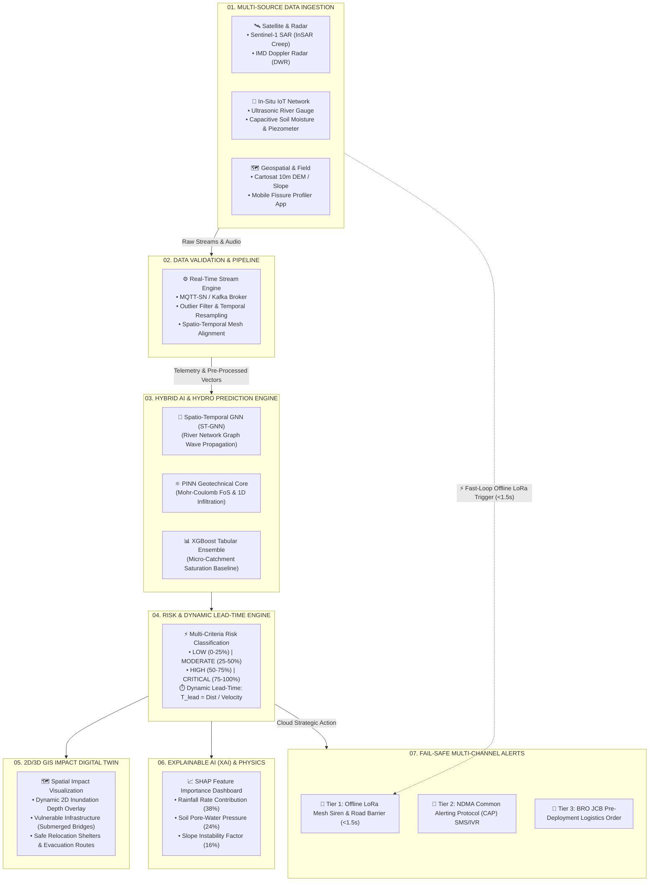

# 🏆 SIH 2026: The Unified "Best Approach" Disaster Early Warning System
> **Smart India Hackathon (SIH 2026) | National Winning Blueprint**  
> **Topic:** Flash Flood & Landslide Multi-Hazard Early Warning, Inundation Prediction & Lifeline Resilience  
> **Synthesis:** Combining the *Clean 7-Stage Visual Flow (Teammate's Design)* with *Deep Geotechnical Physics, Spatio-Temporal GNNs, and Zero-Internet LoRa Mesh (Our Research)*.

---

## 📌 Executive Overview: Why Unification is Necessary

| Perspective | Strength | Limitation if used alone |
| :--- | :--- | :--- |
| **Teammate's Diagram** | Super clean visual design, intuitive 7-step pipeline, excellent use of Explainable AI (SHAP), clear risk buckets (0-100%). | Uses standard XGBoost (tabular, non-spatial), relies on cloud/SMS (fails when towers collapse), lacks lead-time ($T_{\text{lead}}$) calculation. |
| **Our Deep-Tech Research** | Geotechnical physics (PINN), cloud-penetrating SAR radar, sub-surface acoustics, offline LoRa mesh sirens, and BRO logistics. | High technical density; can feel overwhelming if not structured into an intuitive visual narrative. |
| **🏆 Unified "Best Approach"** | **Best of Both Worlds:** Retains the elegant, easy-to-understand 7-box structure while replacing generic models with robust, field-tested physics, spatio-temporal AI, and offline fail-safes. | **100% Defensible under scrutiny from NDRF, CWC, GSI, and MHA judges.** |

---

## 📊 1. Comprehensive Side-by-Side Comparison Matrix

| Pipeline Stage | 📱 Teammate's Original Approach | 🚀 Our Deep-Tech Upgrades | 🏆 The Unified Best Approach (Final Recommendation) |
| :--- | :--- | :--- | :--- |
| **01. Data Sources** | Weather API, River Level, Soil Moisture, DEM Slope, Temp/Pressure. | Sentinel-1 C-Band SAR (InSAR), IMD Doppler Radar (DWR), Sub-Surface Geophone, Mobile Crack Profiler. | **Multi-Modal Data Ingestion:**<br>• *Remote Sensing:* Sentinel-1 SAR + IMD Doppler Radar<br>• *In-Situ IoT:* Ultrasonic Water Gauge + Capacitive Soil Moisture + Piezometer<br>• *Terrain & Field:* Cartosat 10m DEM + Mobile Edge Road Fissure Cam. |
| **02. Processing** | Basic data cleaning, outlier detection, normalization, temporal aggregation. | Spatial raster interpolation, Topographic Wetness Index (TWI), InSAR phase coherence extraction. | **Hydro-Geospatial Stream Pipeline:**<br>• Real-time MQTT/Kafka streaming<br>• Spatio-temporal alignment of radar grids and point IoT sensors<br>• Antecedent Moisture & Infiltration Pre-computation. |
| **03. ML / AI Engine** | Standard **XGBoost** (Tabular Classification / Probability). | **Spatio-Temporal GNN (ST-GNN)** for river topologies + **PINN** (Mohr-Coulomb Failure). | **Hybrid Physics-Coupled AI Engine:**<br>• *For Flash Floods:* Spatio-Temporal Graph Neural Network (ST-GNN) modeling river branches as directed graphs.<br>• *For Slope Stability:* PINN computing dynamic Factor of Safety ($F_s$).<br>• *XGBoost:* Kept as fast local tabular ensemble baseline. |
| **04. Risk Engine** | Static Risk Classification (Low: 0-25%, Mod: 25-50%, High: 50-75%, Critical: 75-100%). | Dynamic Evacuation Lead-Time ($T_{\text{lead}}$) + Habitation Vulnerability Index (HVI). | **Risk + Dynamic Lead-Time Engine:**<br>• Retains the 4-tier risk classification (0-100%)<br>• **Crucial Addition:** Dynamic Lead-Time Window (e.g., *"Time-to-Peak: 42 Mins | Evac Window: 28 Mins"*)<br>• Habitation Exposure Index (demographics + kutcha house ratio). |
| **05. GIS & Impact** | Leaflet map with point icons (Villages, Roads, Rivers, Bridges). | 2D Hydrodynamic Inundation raster overlay + 3D CesiumJS Digital Twin + BRO Route Centrality. | **Interactive 2D/3D Impact Digital Twin:**<br>• Interactive 2D Flood Inundation Depth layer (Water spreading over DEM)<br>• Automated identification of submerged bridges & cut-off road networks<br>• Safe relief camp shelter routing. |
| **06. Explainability** | SHAP Donut Chart showing Feature Importance (Rainfall, Soil Moisture, Slope, etc.). | Coupling SHAP with Geotechnical & Hydro Physics Parameters (Pore Pressure, Shear Stress). | **Physics-Enriched SHAP Dashboard:**<br>• Visual SHAP feature attribution (Awesome feature from teammate!)<br>• Live display of underlying physical drivers ($F_s < 1.0$, Soil Saturation Index $> 85\%$, Upstream Surge Velocity). |
| **07. Alerts & Action** | Early Warning Dashboard, Email, SMS\*, Mobile Notifications\*. | Zero-Internet Solar LoRaWAN Mesh Siren (<1.5s) + BRO Excavator Pre-positioning Engine. | **Multi-Tier Fail-Safe Alerting:**<br>• **Tier 1 (Offline First):** Solar LoRa Mesh triggers physical siren & LED road barrier in $<1.5\text{s}$ without internet.<br>• **Tier 2 (Government/Public):** Common Alerting Protocol (CAP) SMS & IVR.<br>• **Tier 3 (Logistics):** Automated BRO JCB/Excavator dispatch recommendations. |

---

## 🏛️ 2. The Unified 7-Stage System Flow Architecture

Neeche poora unified workflow diagram diya gaya hai jo aapke teammate ke visual boxes ko retain karta hai aur usme deep-tech modules ko fit karta hai:



---

## 🔬 3. Deep Technical Breakdown of the 7 Unified Stages

### Stage 01: Multi-Modal Data Sources (Busting the Optical Barrier)
* **Satellite SAR (Sentinel-1):** Optical satellites monsoons me fail hote hain; Sentinel-1 C-Band SAR badalon ke aar-paar dekh kar ground micro-displacement (2–15 mm/week) detect karta hai.
* **IMD Doppler Weather Radar (DWR):** Cloudburst events (100mm/hr) ka 1 km grid par instant precipitation rate deta hai.
* **In-Situ Micro IoT Nodes:** River water level (ultrasonic) + soil moisture + subsurface piezometer probes.
* **Mobile Road Patrol Tool:** Field officers mobile app se road ke tension cracks ko measure karke instant geotag karte hain.

### Stage 02: Validation & Geospatial Ingestion Pipeline
* **MQTT-SN / Kafka Broker:** Low-bandwidth, high-frequency IoT telemetry ko ingest karta hai.
* **Spatio-Temporal Resampling:** Point sensor data aur radar grid data ko common time-slice ($t = 10\text{ mins}$) par synchronize karta hai.
* **Topographic Pre-processing:** DEM se Slope, Flow Direction, Flow Accumulation, aur Topographic Wetness Index (TWI) pre-calculate hote hain.

### Stage 03: Hybrid Physics-Coupled AI Prediction Core
* **Why not XGBoost alone?** Hilly rivers independent tables nahi hain; wo connected branch networks hain. Upstream stream me paani aane par downstream me time lag ke sath surge aata hai.
* **Spatio-Temporal Graph Neural Network (ST-GNN):** River basin ko directed graph $(V, E)$ me model karta hai (Nodes = Gauges, Edges = Flow Channels).
* **Physics-Informed Neural Network (PINN):** Soil shear strength aur water pressure ko Mohr-Coulomb equation se couple karke **Factor of Safety ($F_s$)** compute karta hai:
  $$F_s = \frac{c' + (\gamma \cdot z - \gamma_w \cdot h_w) \cos^2\beta \cdot \tan\phi'}{\gamma \cdot z \cdot \sin\beta \cdot \cos\beta}$$
* **XGBoost Ensemble:** Fast micro-catchment classification ke liye as an auxiliary layer operate karta hai.

### Stage 04: Risk Classification & Dynamic Evacuation Lead-Time
* **4-Tier Risk Buckets:** Low ($<25\%$), Moderate ($25-50\%$), High ($50-75\%$), Critical ($>75\%$).
* **Dynamic Lead-Time Calculation ($\mathbf{T_{\text{lead}}}$):**
  $$T_{\text{lead}} = \frac{\text{Distance of Habitation from Upstream Flash Point}}{\text{Shallow Water Surge Wave Speed } (v = \sqrt{g \cdot y})} - \Delta t_{\text{processing}}$$
  * *Example Output:* `Risk: 82% (CRITICAL) | Surge Arrival in: 45 Mins | Safe Evac Window: 30 Mins`.

### Stage 05: 2D/3D GIS Impact Digital Twin
* **Dynamic Inundation Layer:** Map par static red circles ke bajaye DEM elevation par 2D blue water inundation spread animate hota hai.
* **Infrastructure Vulnerability Assessment:** System pinpoint karta hai:
  * *Bridge #3 (NH-58)* agle 25 min me submerse hoga.
  * *Village Rampur* ki 35 houses cut-off honge.
  * *Relocation Site:* 2.4 km door Safe Green Zone Community Hall.

### Stage 06: Explainable AI (SHAP) + Geotechnical Attribution
* **SHAP (SHapley Additive exPlanations):** Model ke black-box decision ko tod kar clear visual donut chart me dikhata hai ki alert kyun generate hua:
  * Rainfall Intensity: $+38\%$
  * Soil Saturation ($>92\%$): $+26\%$
  * Steep Slope ($>35^\circ$): $+18\%$
  * Upstream Gauge Surge: $+18\%$
* **Govt Approval:** District Magistrates aur Disaster Officers bina kisi confusion ke decision approve kar sakte hain.

### Stage 07: Fail-Safe Multi-Channel Alerting & Logistics
* **Tier 1 (Offline-First LoRa Mesh):** Cell tower collapse hone par bhi hillside node radio frequency (868 MHz) se hill-base par lage **Solar Siren aur Road Barrier** ko $<1.5\text{s}$ me trigger karta hai.
* **Tier 2 (Public Warning):** Common Alerting Protocol (CAP) ke through targeted village telecom towers par emergency flash SMS aur automated IVR calls.
* **Tier 3 (BRO Logistics Dispatch):** Border Roads Organisation (BRO) ko nearest JCBs aur earthmovers ko vulnerable road pass par pre-deploy karne ka tactical order.

---

## 🎨 4. Direct Template for Updating Your Slide / Poster

Aapka teammate Figma / Canva / Photoshop me apne existing layout ko easily update kar sakta hai is exact structured text se:

```text
====================================================================================================
SLIDE HEADER:
FLASH FLOOD & MULTI-HAZARD EARLY WARNING SYSTEM
Multi-Source Data ➔ Physics-AI Core ➔ Impact Digital Twin ➔ Offline-First Alerts
====================================================================================================

BOX 01 | DATA SOURCES:
• Satellite SAR (Sentinel-1 InSAR) & IMD Doppler Radar (DWR)
• In-Situ IoT: Ultrasonic River Level, Capacitive Soil Moisture & Piezometer
• Cartosat 10m DEM / Slope & Mobile Road Fissure Profiler

BOX 02 | DATA PROCESSING:
• Real-time MQTT-SN / Kafka Stream Ingestion
• Spatio-Temporal Data Harmonization & TWI Extraction
• Automated Quality Control & Outlier Filtering

BOX 03 | HYBRID AI & HYDRO ENGINE:
• Spatio-Temporal Graph Neural Network (ST-GNN) for River Mesh Topologies
• Physics-Informed Neural Network (PINN) for Dynamic Factor of Safety (FoS)
• XGBoost Ensemble for Micro-Catchment Saturation Modeling

BOX 04 | RISK & LEAD-TIME ENGINE:
• 4-Tier Dynamic Risk: LOW (<25%) | MODERATE (25-50%) | HIGH (50-75%) | CRITICAL (75-100%)
• Dynamic Evacuation Lead-Time Window (Time-to-Peak in Minutes)
• Habitation Vulnerability Index (HVI) Scoring

BOX 05 | GIS & IMPACT DIGITAL TWIN:
• 2D Hydrodynamic Flood Inundation & Depth Mapping
• Critical Infrastructure Outage (Submerged Bridges & Blocked Passes)
• AI Relocation Routing to Safe Green Shelters

BOX 06 | EXPLAINABLE AI (SHAP):
• Real-Time SHAP Feature Attribution (Why is risk High/Critical?)
• Integrated Geotechnical Drivers (Pore-Water Pressure, Shear Stress)
• High Transparency for District Disaster Management Authorities (DDMAs)

BOX 07 | FAIL-SAFE MULTI-TIER ALERTS:
• Tier 1: Solar LoRaWAN Mesh Siren & Road Barrier (<1.5s Zero-Internet Trigger)
• Tier 2: Common Alerting Protocol (CAP) SMS & Multilingual IVR
• Tier 3: BRO Pre-Disaster Logistics & JCB Pre-positioning Order

FOOTER TECH STACK:
DATABASE: PostgreSQL + PostGIS | TimescaleDB
BACKEND: FastAPI (Python) | PyTorch Geometric | Celery | Redis
FRONTEND: React.js | MapLibre GL / CesiumJS 3D
EDGE / HARDWARE: ESP32-S3 | LoRa SX1262 (868 MHz) | Piezo Geophone Probe
====================================================================================================
```

---

## 🛡️ 5. Jury Defense Cheat-Sheet (Grand Finale Q&A)

### ❓ Question 1: *"Monsoons me badal hone par satellite data kaise milega?"*
> **Your Answer:** *"Sir/Ma'am, generic solutions optical satellite (Sentinel-2) use karti hain jo fail ho jaata hai. Hamara system Sentinel-1 C-Band Synthetic Aperture Radar (SAR) use karta hai. Radar microwaves badalon aur barsaat ke aar-paar dekh kar ground ka millimeter-level deformation (InSAR creep) measure karti hain."*

### ❓ Question 2: *"Agar landslide me mobile towers aur light chali jaye toh SMS alert kaise pahuchega?"*
> **Your Answer:** *"Hamara system cloud-dependent nahi hai. Hillside par deployed sensor nodes battery/solar-powered LoRa Mesh Network par operate karte hain. Agar poora cell network down bhi ho, tab bhi hill-base par laga siren aur physical road barrier 1.5 second me local radio frequency se activate ho jata hai."*

### ❓ Question 3: *"Simple XGBoost ya Random Forest se flash flood kyun nahi predict ho sakta?"*
> **Your Answer:** *"Flash flood tabular problem nahi hai; ye spatial hydrodynamic wave propagation problem hai. Ek river network ek directed graph hota hai. Isliye hum Spatio-Temporal Graph Neural Networks (ST-GNN) use karte hain jo upstream sensor ki velocity aur stage height ko downstream nodes par time-lag ke sath accurately predict karta hai."*

---

## 📁 Related Masterplan File Reference
- Full Deep-Tech System Architecture & Hardware BOM: [SIH2026_Disaster_Early_Warning_Architecture_Masterplan.md](file:///d:/SIH2026/SIH2026_Disaster_Early_Warning_Architecture_Masterplan.md)
