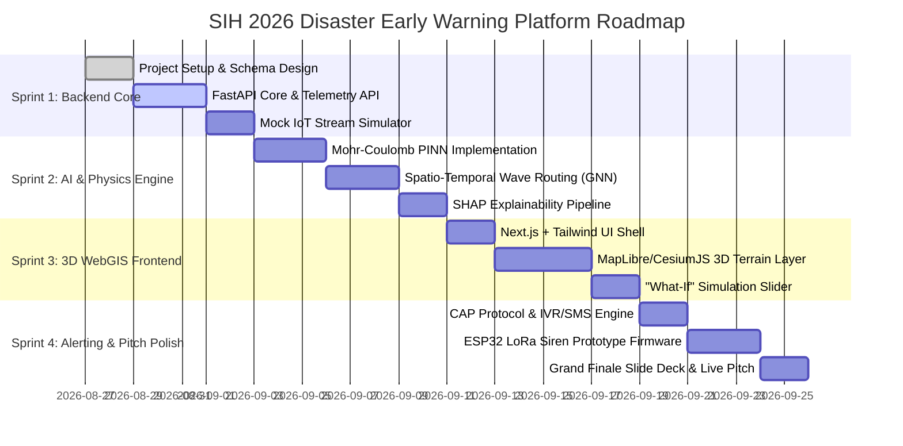

# 🚀 GeoResilience AI: Engineering Roadmap & Milestones
## 📅 SIH 2026 Development Sprints & Deliverables Plan

---

## 🎯 4-Sprint Implementation Roadmap



---

## 📋 Sprint-by-Sprint Breakdown

### 🏁 Sprint 1: Foundation & Telemetry Ingestion (Week 1)
* [ ] Setup FastAPI repository structure with modular router configuration.
* [ ] Create PostgreSQL + PostGIS spatial schema with sample Himalayan basin coordinates.
* [ ] Implement high-speed `POST /api/v1/telemetry/ingest` and WebSocket live feed.
* [ ] Build a Python-based **Mock Multi-Sensor Fleet Simulator** that streams realistic flood/landslide time-series data.

### 🧠 Sprint 2: Physics-Coupled AI & Lead-Time Engine (Week 2)
* [ ] Implement the **Mohr-Coulomb Factor of Safety ($F_s$)** mathematical module in Python.
* [ ] Implement the **Dynamic Evacuation Lead-Time ($T_{\text{lead}}$)** computation.
* [ ] Integrate the **SHAP Feature Attribution Module** to explain risk levels (Rainfall %, Soil %, Slope %).
* [ ] Build the safe relocation carrying capacity optimizer.

### 🗺️ Sprint 3: 3D WebGIS & Interactive Digital Twin (Week 3)
* [ ] Initialize Next.js 14 frontend with TailwindCSS dark mode UI.
* [ ] Integrate MapLibre GL / CesiumJS 3D terrain viewer with contour draping.
* [ ] Add dynamic **2D Flood Inundation Depth Simulation** layer.
* [ ] Implement the **"What-If" Climate Slider** (Adjusting rainfall from 20mm $\to$ 150mm updates risk zones in real time).

### 🚨 Sprint 4: Fail-Safe Alerts & Grand Finale Polish (Week 4)
* [ ] Implement Common Alerting Protocol (CAP) SMS / WhatsApp dispatcher mock.
* [ ] Write the C++ firmware for the ESP32 LoRa wireless siren transmitter/receiver.
* [ ] Prepare the Grand Finale pitch deck, live demo script, and jury evaluation defense.

---

## 🗂️ Standard Project Repository Structure

```
SIH2026/
├── docs/
│   ├── PRD_Disaster_Early_Warning_System.md
│   ├── SRS_Technical_Specifications.md
│   └── PROJECT_ROADMAP.md
├── backend/
│   ├── app/
│   │   ├── api/          # FastAPI Routes (telemetry, predict, gis, alerts)
│   │   ├── core/         # Config, Database connection, Security
│   │   ├── models/       # PostGIS SQLAlchemy & Pydantic models
│   │   ├── physics_ai/   # Mohr-Coulomb PINN, ST-GNN & SHAP engine
│   │   └── services/     # Inundation simulation, routing & alerting
│   ├── main.py           # Application Entry Point
│   └── simulator.py      # Virtual IoT Fleet Telemetry Generator
├── frontend/
│   ├── src/
│   │   ├── components/   # 3D Map, SHAP Card, What-If Slider, Hydrographs
│   │   ├── pages/        # SDMA War Room, Public Alert Portal
│   │   └── services/     # API Client & WebSocket handlers
│   └── package.json
└── firmware/
    ├── esp32_sensor_node/    # PlatformIO C++ Sensor Firmware
    └── esp32_siren_receiver/ # LoRa Siren Actuator Firmware
```
